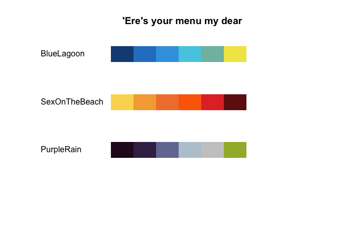
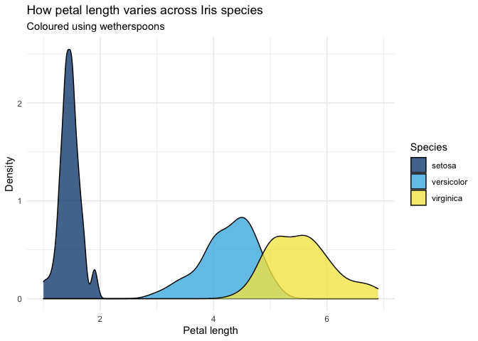
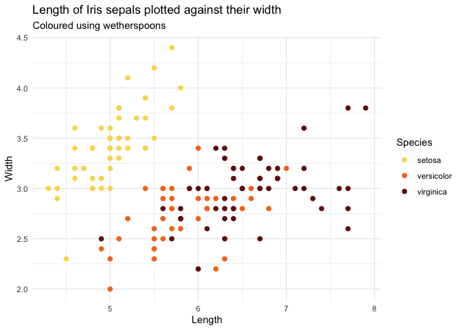
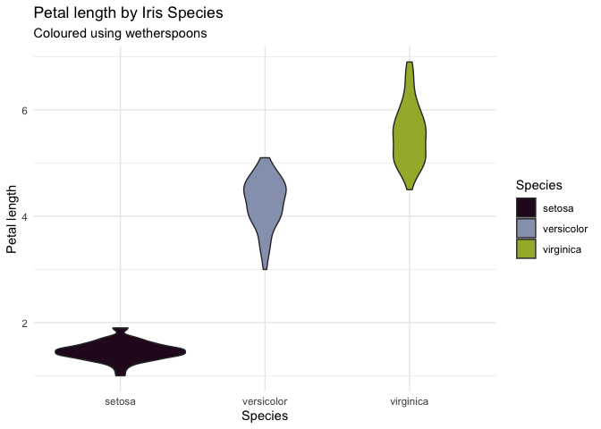

<!-- README.md is generated from README.Rmd. Please edit that file -->

# wetherspoons

It’s a hot summer’s day and you’re sipping on your 2-for-£12 pitchers
from your local spoons (<https://www.jdwetherspoon.com/> for you
uncultured swines). ‘Wow, what a pretty cocktail I’m drinking’, you
think to yourself. ‘If only I could use these colours on my next
coursework assignment’. Well fear not…

This package provides palettes inspired by the cocktails of JD
Wetherspoon (and by the amazing
[`MetBrewer`](https://github.com/BlakeRMills/MetBrewer/)).

Feel free to contact me with comments or suggestions: <br /> LinkedIn:
[@dougal-toms](https://www.linkedin.com/in/dougal-toms/)<br /> Twitter:
[@DougalToms](https://www.twitter.com/DougalToms)

## Installation

`wetherspoons` can be installed through GitHub

``` r
install.packages("devtools")
devtools::install_github("dougaltoms/wetherspoons")
```

## Palettes

An overview of available cocktail palettes can be had with the
`WhatsOnTheMenu()` function:

``` r
library(wetherspoons)

wetherspoons::WhatsOnTheMenu()
```

<!-- -->

Once you’ve chosen your cocktail, you can generate colour values by
ordering a pitcher of, using the `pitcher.of()` function:

``` r
wetherspoons::pitcher.of("BlueLagoon")
```

    ## [1] "#164D83" "#2A81CA" "#3CA2E1" "#55CCE3" "#80BCAE" "#F2E554"

## Examples

`wetherspoon` provides relevant scales for use with `ggplot2`

``` r
library(ggplot2)

ggplot(iris, aes(x = Petal.Length, fill = Species)) +
  geom_density(alpha = 0.8)+
  scale_fill_manual(values=pitcher.of("BlueLagoon",3))+
  labs(x="Petal length", y="Density",
       title="How petal length varies across Iris species",
       subtitle="Coloured using wetherspoons")+
  theme_minimal()
```

<!-- -->

``` r
library(ggplot2)

ggplot(data=iris, aes(x=Sepal.Length, y=Sepal.Width, color=Species)) +
  geom_point(size=2) +
  scale_color_manual(values=pitcher.of("SexOnTheBeach",3))+
  labs(x="Length", y="Width",
       title="Length of Iris sepals plotted against their width",
       subtitle = "Coloured using wetherspoons")+
  theme_minimal()
```

<!-- -->

``` r
library(ggplot2)

ggplot(data=iris, aes(x=Species, y=Petal.Length, fill=Species)) +
  geom_violin() +
  scale_fill_manual(values=pitcher.of("PurpleRain",n=3, direction=1))+
  labs(title="Petal length by Iris Species", y="Petal length",
       subtitle="Coloured using wetherspoons")+
  theme_minimal()
```

<!-- -->
